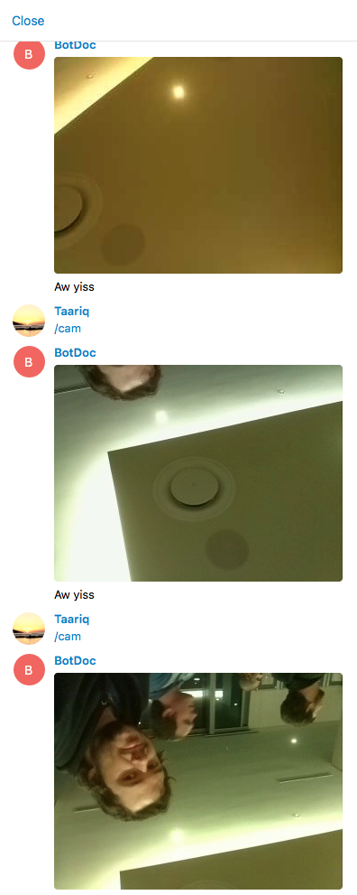

# telegram-webcam-quickstart

Please check out Nicola Ferraro's [blog post] (https://www.nicolaferraro.me/2016/05/27/creating-a-telegram-bot-in-5-minutes-with-apache-camel/) for the vanilla telegram bot.

This fork is for a Java Meetup demo I recently did, showing a Telegram bot posting images from a Raspberry Pi.

We also talked a lot about Camel routing, for more of that check out Claus Ibsen's [latest talks at JDK.IO 2016] (http://www.davsclaus.com/2016/09/videos-from-my-two-latest-talks-about.html)

The quickstart can work without any modification to the code if you just put your Telegram authorization token into the [application.yml](/src/main/resources/application.yml) file.

To get an image from your webcam, type /cam

You can change the [Bot](src/main/java/com/example/Bot.java) class to customize the behavior.

# build
You can also package and run the fatjar as follows;

    mvn clean install

    java -jar telegram-webcam-quickstart-1.0.0-SNAPSHOT.jar

